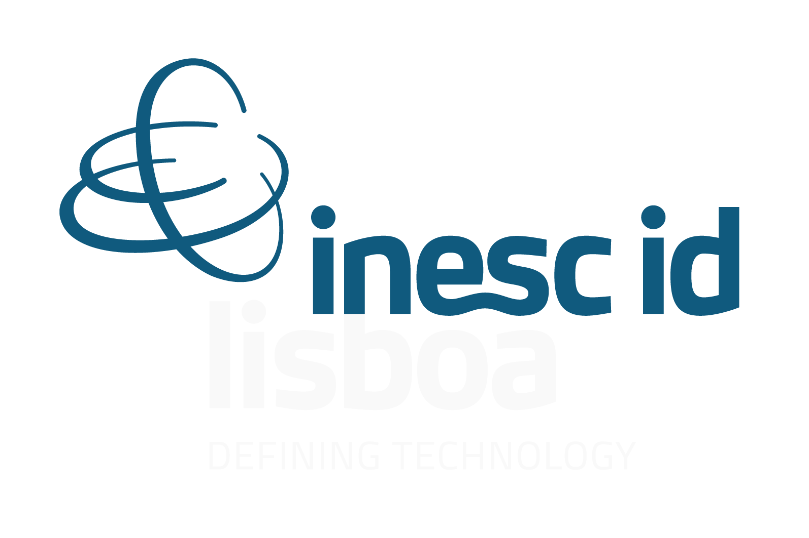

# Energycompress

EnergyCompress is a general case base learning strategy
that can be used to learn a competent case base for ML algorithms such as $k$-NN, both reducing inference time and increasing prediction performance.

EnergyCompress results from the collaboration of computer science researchers from $5$ different research labs:

&nbsp; 
&nbsp; 
&nbsp; 
&nbsp; 
&nbsp; 
  

__Paper__ ([link](https://lavieenbl.eu/publis/energycompress-ijcai25-final.pdf))

EnergyCompress: A General Case Base Learning Strategy. F. Badra, E. Marquer, M.-J. Lesot, M. Couceiro and D. Leake (2025)
International Joint Conference on Artificial Intelligence (IJCAI), Montreal, Canada. 

__Abstract__

Case-based prediction (CBP) methods do not learn
a model of the target decision function but instead
perform an inference process that depends on two
similarity measures and a reference case base. This
paper proposes a strategy, called EnergyCompress,
to learn an effective case base by selecting relevant
cases from an initial set. Use of EnergyCompress
decreases CBP inference time, through case base
compression, and also increases prediction perfor-
mance, for a wide variety of CBP algorithms. Ener-
gyCompress relies on a general formulation of the
CBP task in the framework of energy-based mo-
dels, which leads to a new and valuable characte-
rization of the notion of competence in case-based
reasoning, in particular at the source case level.
Extensive experimental results on 18 benchmarks
comparing EnergyCompress to 5 reference algo-
rithms for case base maintenance support the bene-
fit of the proposed strategy.

